<a name="readme-top"></a>

<!-- PROJECT LOGO -->
<br />
<div align="center">
  <h3 align="center">Image Classification Project</h3>
  <p align="center">
    Balanced dataset preparation and image classification of Hammers, Axes, and Books using VGG, ResNet and Basic CNN models
    <br />
    <a href="https://github.com/eliasmarcon/Image-Classification/issues">Report Bug</a>
    ·
    <a href="https://github.com/eliasmarcon/Image-Classification/issues">Request Feature</a>
  </p>
</div>

<!-- TABLE OF CONTENTS -->
<details>
  <summary>Table of Contents</summary>
  <ol>
    <li><a href="#installation">Requirements Installation</a></li>
      <ol>
          <li><a href="#using-python-with-requirementstxt">Using Python with requirements txt file</a></li>
          <li><a href="#using-conda-on-a-slurm-cluster">Using Conda on a SLURM Cluster</a></li>
      </ol>
    <li><a href="#file-structure">File Structure</a></li>
    <li><a href="#dataset">Dataset</a></li>
      <ol>
        <li><a href="#dataset-balancing">Dataset Balancing</a></li>
        <li><a href="#image-formats-and-resizingpadding">Image Formats and Resizing/Padding</a></li>
        <li><a href="#data-augmentation">Data Augmentation</a></li>
          <ul>
            <li><a href="#applying-augmentations">Applying Augmentations</a></li>
            <li><a href="#ensuring-a-clean-testing-dataset">Ensuring a Clean Testing Dataset</a></li>
          </ul>
        <li><a href="#creating-everything-for-the-dataset">Creating everything for the Dataset</a></li>
      </ol>
    <li><a href="#important-files">Important Files</a></li>
    <li><a href="#model-details">Model Details</a></li>
    <li><a href="#training--testing">Training & Testing</a></li>
      <ol>
        <li><a href="#tracking--logging">Tracking / Logging</a></li>
        <li><a href="#model-testing-results">Model Testing results</a></li>
          <ol>
            <li><a href="#results-vgg19_no_change">Results VGG19_no_change</a></li>
            <li><a href="#results-vgg19_adapted">Results VGG19_adapted</a></li>
            <li><a href="#results-customvgg">Results CustomVGG</a></li>
            <li><a href="#results-cnnbasic">Results CNNBasic</a></li>
            <li><a href="#results-resnet18">Results ResNet18</a></li>
          </ol>
        <li><a href="#overall-results">Overall Results</a></li>
      </ol>
      <li><a href="#activation-maps">Activation Maps</a></li>
  </ol>
</details>

<br>

# Requirements

Before running the code locally or on a SLURM cluster, please ensure the necessary dependencies are installed. For detailed instructions on setting up the environment look at the sections below. In order to run the code and created models, refer to the [Training & Testing](#training--testing) section.

## Using Python with requirements.txt

1. **Local Environment:**

   - Ensure Python (>=3.10) and pip are installed.

   - Clone the repository:

     ```bash
     git clone <repository_url>
     cd <repository_name>
     ```

   - Install dependencies from `requirements.txt`:
     ```bash
     pip install -r requirements.txt
     ```

## Using Conda on a SLURM Cluster

1. **Setting Up Conda Environment:**

   - Connect to the SLURM cluster.

   - Install all requirements and other dependencies:
     ```bash
     sbatch setup_conda.sh
     ```

2. **Using the Repository:**

   - Note: The FiftyOne library is not available via Conda. Use pip to install it separately if needed:

     ```bash
     pip install fiftyone
     ```

   - Ensure all provided data dependencies are available and accessible within the environment.

3. **Running the Code:**

   - in the `run_cluster.sh` and `run_cluster_sets.sh` file the created conda environment is activated, used and then after the job is done, deactivated.

# File Structure

The file structure of this repository is designed to keep things organized and accessible, allowing for easy navigation and efficient project management.

```

├── dataset/                # All files for every category
│   ├── Axe/                # Raw dataset files for Axe category
│   ├── Axe_augmented/      # Augmented dataset files for Axe category
│   ├── Book/               # Raw dataset files for Book category
│   ├── Hammer/             # Raw dataset files for Hammer category
│   ├── Hammer_augmented/   # Augmented dataset files for Hammer category
├── dataset_testing/        # Dataset used for model testing
│   ├── Axe/                # Testing files for Axe category
│   ├── Book/               # Testing files for Book category
│   ├── Hammer/             # Testing files for Hammer category
├── parameters/             # Hyperparameter sets for model configurations
├── readme_images/          # Images used in the README documentation
├── saved_models/           # Directory containing the best saved models
├── src/                    # Source code directory
│   ├── dataset/            # Scripts for creating and manipulating data
│   ├── models/             # Model architecture files
│   ├── pipeline/           # Scripts for logging, metrics, training, and testing
├── clean_runs.csv          # Log of runs and results
```

<p align="right">(<a href="#readme-top">back to top</a>)</p>

# Dataset

This section provides an overview of the steps taken to prepare a balanced dataset for this computer vision project. The dataset contains images of three classes: Axe, Book and Hammer from the Open Images V7 dataset.

In order to create the dataset from scratch, the following python command needs to be executed.

```
python ./src/dataset/preparedataset.py
```

The initial dataset was sourced from the fiftyone library, which provides access to the Open Images V7 dataset. The dataset was specifically filtered to include only images containing the classes: Axe, Book and Hammer. It was loaded with a maximum of 1,000 samples and shuffled to ensure randomness.

<p align="right">(<a href="#readme-top">back to top</a>)</p>


## Dataset Balancing

The initial dataset was imbalanced, with a significantly higher number of images in the "Book" category, as shown in the following graph.

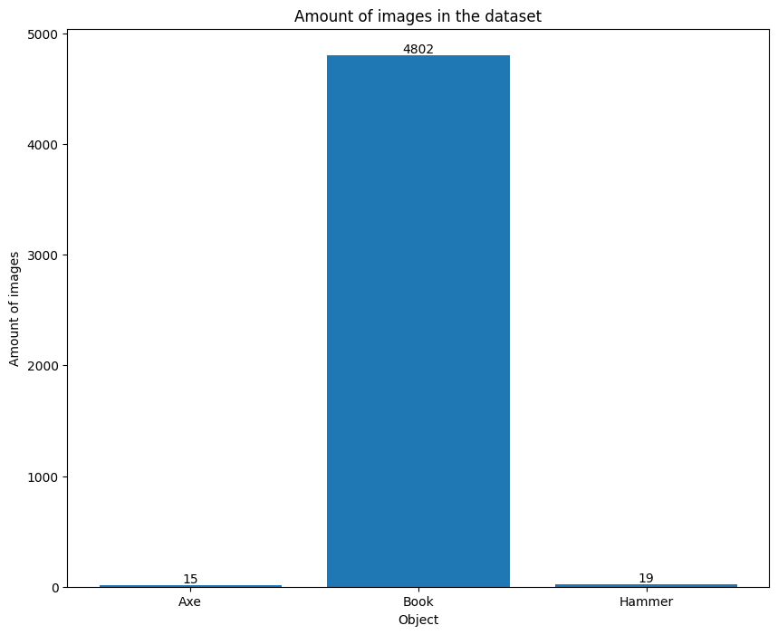

To address this imbalance and ensure fair representation of each class, the number of images in the "Book" category was reduced to 1,500. To increase the number of images in the "Hammer" and "Axe" categories, the `preparedataset.py` script was executed multiple times. Images across all categories, particularly "Hammer" and "Axe," were reviewed and duplicates were removed. The graph below illustrates the dataset distribution after these adjustments.

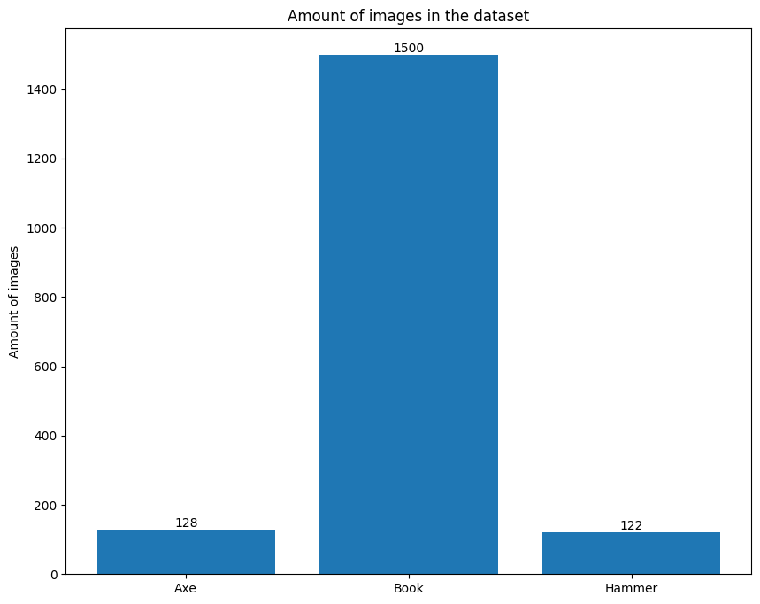

<p align="right">(<a href="#readme-top">back to top</a>)</p>

## Image Formats and Resizing/Padding

The images in the dataset come in various formats. Each category includes images with different resolutions and aspect ratios, which is typical for datasets sourced from diverse origins. To ensure consistency and compatibility with all models, all images are resized/padded to 224x224 pixels. This resizing/padding standardizes the input size, adhering to the requirements of all models, which expects images of this dimension for optimal performance. Resizing/padding all images to 224x224 pixels ensures uniformity across the dataset, facilitating more effective training and evaluation of the VGG model.

Summary of Image Formats:

- Axe: 119 distinct formats 
- Book: 1457 distinct formats
- Hammer: 113 distinct formats

A sample of the resized/padded images can be seen here:

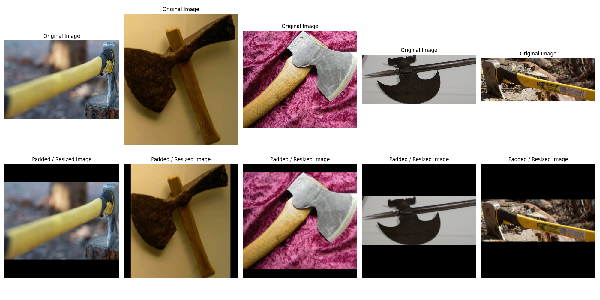

<p align="right">(<a href="#readme-top">back to top</a>)</p>

## Data Augmentation

To achieve a balanced dataset across the three classes (Axe, Book, Hammer), data augmentation techniques are employed. These augmentations increase the diversity of the training data without collecting new images, enhancing the model's ability to generalize. The following augmentations are applied:

- **Random Rotation**: Images are randomly rotated by up to 40 degrees.
- **Random Translation**: Images are randomly shifted horizontally and vertically by up to 20%.
- **Random Horizontal Flip**: Images are flipped horizontally with a probability of 0.8.
- **Random Vertical Flip**: Images are flipped vertically with a probability of 0.8.
- **Color Jitter**: The brightness, contrast, saturation, and hue of the images are randomly changed by up to 50%.
- **Gaussian Blur**: A Gaussian blur with a kernel size of 3 is applied to the images.

The `create_augmented_data` function in the `./src/dataset/augmentation_data.py` file is designed to balance the dataset by oversampling the minority classes (Axe and Hammer) through data augmentation so that they have the same number of images as the majority class (Books). Books, being the majority class, are not augmented. The augmentation process is specifically targeted at the underrepresented classes (Axe and Hammer) to ensure that all classes have an equal number of images, thereby creating a balanced dataset.

<p align="right">(<a href="#readme-top">back to top</a>)</p>

### Applying Augmentations

In addition to defining individual augmentations, a random subset of these augmentations is dynamically applied to each image to further increase variability and robustness.

- **Define the augmentation choices**: A list of potential augmentations is defined, including random rotation, random affine transformation, random horizontal and vertical flips, color jitter, and Gaussian blur.
- **Randomly choose a subset of augmentations**: A random number of augmentations (between 1 and 6) is selected, and then a random subset of these augmentations is chosen.
- **Apply the augmentations**: The chosen augmentations are sequentially applied to the image.

This approach ensures that each image undergoes a unique combination of transformations, further enhancing the diversity of the training dataset. Here is an example of how this process is implemented:

A sample of the augmented images can be seen here:

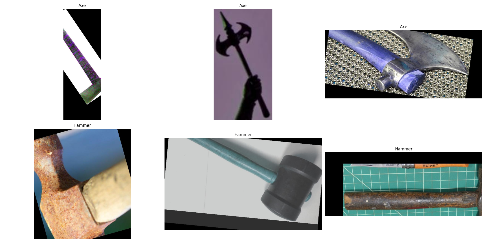

<p align="right">(<a href="#readme-top">back to top</a>)</p>

### Ensuring a Clean Testing Dataset

To ensure that the testing dataset is not influenced by augmented images, the following steps are taken:

1. Initial Testing Set Creation:

    - Before applying augmentations, 30 images from each class are moved to the `dataset_testing` folder. This ensures that the testing phase evaluates the model's performance on original, non-augmented images.

2. Additional Data Collection:

    - To further balance the dataset, 5 images from each class are sourced from the internet and added to the corresponding class folders. This helps in maintaining a robust and varied dataset.

<p align="right">(<a href="#readme-top">back to top</a>)</p>

## Creating everything for the Dataset

In order to create everything outlined in the Dataset chapters, execute the following script:

```
python ./src/dataset/dataset_main.py
```

The provided code performs several key steps to prepare and augment a dataset for image classification:

- **Directory Setup**:
  - Creates a directory for storing images used in the README.
- **Dataset Analysis**:
  - Plots the dataset size before and after reducing it to 1500 images per class.
  - Plots statistics on image formats.
- **Image Preprocessing**:
  - Creates a testing batch.
  - Loads a subset of images and plots both original and padded versions.
- **Data Augmentation**:
  - Loads the entire dataset.
  - Augments images from the minority classes (Axe and Hammer) to match the number of images in the majority class (Books).
  - Plots examples of the augmented images.

<p align="right">(<a href="#readme-top">back to top</a>)</p>

# Important Files

This sub-chapter provides an overview of the components involved in training and evaluating the image classification models. It covers the following key elements:

- **DataLoader**: Custom dataset handler that preprocesses image data, applies transformations, splits data into train and validation sets.
- **Logger**: Tracks and logs the training process, capturing important details such as loss, accuracy, and other metrics over time.
- **Metrics**: Defines the performance metrics used to evaluate the models, ensuring a clear understanding of their accuracy and effectiveness.
- **Models**: Describes the architecture and configurations of the neural network models used for classification.
- **Trainer**: Outlines the training process, including the setup, training loop, and validation steps to optimize model performance.
- **Tester**: Tester class that handles model evaluation, including running tests on a test dataset, creating confusion matrices, and generating heatmaps and CAM (Class Activation Map) visualizations for model interpretability.

<p align="right">(<a href="#readme-top">back to top</a>)</p>

# Model Details

The implemented classes in the file `/src/models.py` define different configurations of the VGG19 model for image classification:

- `VGGModel`: This class initializes the VGG19 model from pytorch, optionally loading pre-trained weights. It replaces the original classifier with custom fully connected layers, including ReLU activations, Batch Normalization, and Dropout, for classification tasks. It provides methods to freeze feature layers, save, and load model states.

- `VGGModelAdapted`: This class extends the VGG19 model from pytorch by incorporating GELU activations and an additional fully connected layer in the classifier. Similar to VGGModel, it supports freezing feature layers and saving/loading model states, offering a modified architecture for potentially improved performance.

- `CustomVGGModel`: This class further customizes the VGG19 model from pytorch by freezing layers up to conv3 and adding new convolutional and fully connected layers with GELU activations, Batch Normalization, and AdaptiveMaxPool2d. It combines pre-trained features with new learnable layers, providing a flexible architecture for image classification tasks.

- `ResNet18`: A ResNet-18 model is used for image classification tasks. Defined separately in the project, it leverages residual connections for deeper architectures.

- `Basic CNN`: A simple CNN architecture tailored for specific image classification requirements. It provides a straightforward baseline for comparison with more complex models like VGG19 and ResNet-18.

<p align="right">(<a href="#readme-top">back to top</a>)</p>


# Training & Testing

To optimize the training of deep learning models, a comprehensive exploration of various hyperparameter combinations was conducted.

- **Model Type**: The experimentation involves evaluating five distinct model architectures: `VGG`, `VGGAdapted`, `CustomVGG`, `ResNet18` and `CNNBasic`.
- **Pretrained**: Each model of the model type 'VGG' is assessed under two conditions: `with pretrained weights (True)` and `without pretrained weights (False)`. The other two are trained `from scratch`.
- **Learning Rate**: Four different learning rates are used: `0.01`, `0.001`, `0.0001`, and `0.00001`. Due do some erros while testing the models `VGG`, `VGGAdapted`, `CustomVGG` are not trained with the learning rate `0.01`.
- **Weight Decay**: Four values for weight decay are investigated: `0.01`, `0.001`, `0.0001`, and `0.00001`.
- **Gamma**: The evaluation includes five values for gamma: `0.95`, `0.96`, `0.97`, `0.98`, and `0.99`.
- **Data Augmentation**: The experimentation covers two scenarios: `with (True)` and `without (False)` data augmentation.

These hyperparameters result in the training of `1040 models`. The models can be trained either locally or on a Slurm cluster using specific cluster scripts: `run_cluster.sh` and `run_cluster_sets.sh`. Here’s how these scripts function:

- locally:

  ```
  python /src/main.py -m VGG -p -e 30 -b 32 -l 0.0005 -w 0.00005 -g 0.99 -f 1 -es 20 -a -c
  ```

  This command will run the script `main.py` located in the `/src/ directory` with the following configurations:

  - **-m** VGG: Specifies the model type as VGG.
  - **-p**: Uses a pretrained model (since it's specified without a value, it defaults to True).
  - **-e** 30: Sets the number of epochs to 30.
  - **-b** 32: Defines the batch size as 32.
  - **-l** 0.0005: Sets the learning rate to 0.0005.
  - **-w** 0.00005: Specifies the weight decay as 0.00005.
  - **-g** 0.99: Sets the gamma value for the learning rate scheduler to 0.99.
  - **-f** 1: Specifies the validation frequency as 1.
  - **-es** 20: Sets the early stopping patience to 20.
  - **-a**: Enables data augmentation for training.
  - **-c**: Enables confusion matrix and heatmaps for testing.

Adjust these arguments based on individual specific requirements and the structure of the main.py script.

- Slurm cluster:

  ```
  sbatch run_cluster.sh CustomVGG True 2 32 0.1 0.001 0.99 false True

  sbatch run_cluster_sets.sh 7
  ```

`run_cluster.sh`: 
  
  - This script allows testing of individual custom hyperparameters. It's suitable for running a single experiment with user-defined settings.
  - The script uses the following arguments:
      - $MODEL_TYPE
      - $PRETRAINED
      - $NUM_EPOCHS
      - $BATCH_SIZE
      - $LEARNING_RATE
      - $WEIGHT_DECAY
      - $GAMMA
      - $DATA_AUGMENTATION
      - $PLOTTING

`run_cluster_sets.sh`: 
  - This script takes an input file number as an argument (`hyperparameter_file_number`) and runs a predefined set of hyperparameters. The hyperparameter set is fetched from a specific file located at `parameters/hyperparameters_{filenumber}.txt`. This approach enables systematic testing of multiple hyperparameter combinations in batch mode on the Slurm cluster.

`setup_conda.sh`: 
  - This script automatically sets up a new conda environment and installs all necessary requirements.

<p align="right">(<a href="#readme-top">back to top</a>)</p>

## Tracking / Logging

Metrics and model training details are logged using the Weights and Biases (wandb) platform. Weights and Biases provides a suite of tools for experiment tracking, including real-time visualization of metrics, model performance, and system metrics. For more details on setting up and using wandb, refer to the [Weights and Biases documentation](https://docs.wandb.ai/?_gl=1*sm4dkz*_ga*MTAxNzQ1OTkzMS4xNzEzNzA0NzUx*_ga_JH1SJHJQXJ*MTcyMDY4ODM2My43OS4xLjE3MjA2ODg4OTUuNDcuMC4w).

<p align="right">(<a href="#readme-top">back to top</a>)</p>

## Model Testing results

This section details the various model groups and their corresponding instance counts used within the project repository. The categorization aims to provide insights into the scale and distribution of experiments and model training runs.

The categorization of model groups and instance counts serves the following purposes:

- `Tracking and Managing Experiments`: Documenting the number of instances per model group facilitates efficient tracking and management of experiments.
- `Comparative Analysis`: Instance counts enable comparative analysis, allowing evaluation of the performance and efficiency of different model architectures.
- `Resource Allocation`: Understanding the distribution of model instances supports optimal allocation of computational resources, ensuring efficient use across experiments.

The following table shows each model and their instance count. The `CNNBasic` and `ResNet18` instance count is smaller due to the fact that these models are just `trained from scratch without using pretrained weights`. All data and results for the runs in this section are in the `clean_runs.csv` file.

| Group           | Instance Count |
| --------------- | -------------- |
| VGG19_no_change | 240            |
| VGG19_adapted   | 240            |
| CustomVGG       | 240            |
| CNNBasic        | 160            |
| ResNet18        | 160            |
| Total           | 1040           |

<p align="right">(<a href="#readme-top">back to top</a>)</p>

### Results VGG19_no_change

The graph illustrates the performance of the top 5 VGG models, comparing their Test Accuracy and Test Per Class Accuracy.

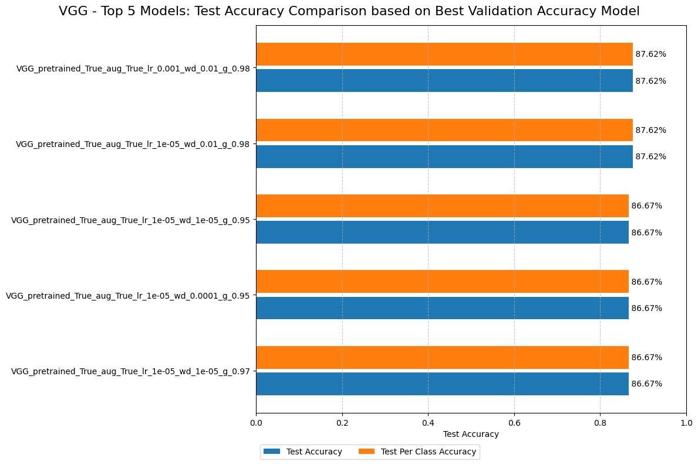

Here are the key observations:

- `Best Performing Models`: The top two models are `VGG_pretrained_True_aug_True_lr_0.001_wd_0.01_g_0.98` and `VGG_pretrained_True_aug_True_lr_1e-05_wd_0.01_g_0.98`, both achieving the highest Test Accuracy and Test Per Class Accuracy at 87.62%.
- `Consistency`: For all models, the Test Accuracy and Test Per Class Accuracy are identical, indicating consistent performance across all classes.
- `Performance Range`: The Test Accuracy for the top 5 models ranges from 86.67% to 87.62%, demonstrating high and consistent performance across different hyperparameter configurations.
- `Hyperparameter Influence`:

  - All top models use pretrained weights (pretrained_True).
  - All top models use data augmentation (aug_True).
  - Learning rates mainly were 1e-05, but the top model used a bigger learning rateof 0.001.
  - Weight decay values range from 1e-05 to 0.01.
  - The gamma value ranges from 0.95 to 0.98.

- `Augmentation Benefit`: The top VGG models perform best with data augmentation, suggesting its effectiveness in improving model performance.
- `Marginal Improvements`: The performance difference between the best and worst model in the top 5 is relatively small (0.95%), indicating that the VGG architecture is robust across various hyperparameter settings.

These results demonstrate that the VGG architecture, when using pretrained weights and data augmentation, achieves excellent performance (above 86%) on this task. The high accuracy across all top models suggests that VGG is particularly well-suited for this classification task. The slight variations in performance due to different learning rates, weight decay, and gamma values highlight the importance of fine-tuning these hyperparameters, even with a robust architecture like VGG.

<p align="right">(<a href="#readme-top">back to top</a>)</p>

### Results VGG19_adapted

The graph presents the performance of the top 5 VGGAdapted models, comparing their Test Accuracy and Test Per Class Accuracy.

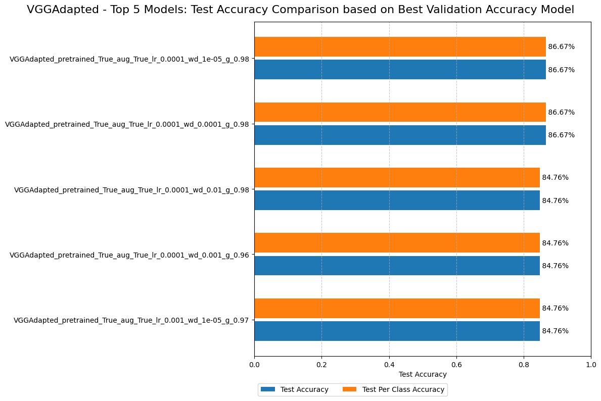

Here are the key insights:

- `Best Performing Models`: The top two models `VGGAdapted_pretrained_True_aug_True_lr_0.0001_wd_1e-05_g_0.98` and `VGGAdapted_pretrained_True_aug_True_lr_0.0001_wd_0.0001_g_0.98` achieve the highest Test Accuracy and Test Per Class Accuracy at 86.67%.
- `Consistency`: For all models, the Test Accuracy and Test Per Class Accuracy are identical, indicating consistent performance across all classes.
- `Performance Range`: The Test Accuracy for the top 5 models ranges from 84.76% to 86.67%, demonstrating excellent and consistent performance across different hyperparameter configurations.
- `Hyperparameter Influence`:

  - All top models use pretrained weights (pretrained_True).
  - All top models use data augmentation (aug_True).
  - The learning rate is consistently 0.0001 for the top 4 models, with one model using 0.001.
  - Weight decay varies between 1e-05 and 0.01.
  - The gamma value is 0.98 for the top 3 models, with others using 0.96 and 0.97.

- `Augmentation Benefit`: The top VGGAdapted  models perform best with data augmentation, suggesting its effectiveness in improving model performance.
- `Marginal Improvements`: The performance difference between the best and worst model in the top 5 is 1.91%, indicating that the VGGAdapted architecture is robust across various hyperparameter settings, but fine-tuning can lead to noticeable improvements.

These results demonstrate that the VGGAdapted architecture achieves outstanding performance (above 84%) on this task. The consistent high accuracy across all top models, especially the two models achieving 86.67%, suggests that VGGAdapted is particularly well-suited for this classification task. The results highlight the importance of using pretrained weights, data augmentation, and careful tuning of learning rate, weight decay, and gamma values to achieve optimal performance.

<p align="right">(<a href="#readme-top">back to top</a>)</p>

### Results CustomVGG

The graph showcases the performance of the top 5 CustomVGG models, comparing their Test Accuracy and Test Per Class Accuracy.

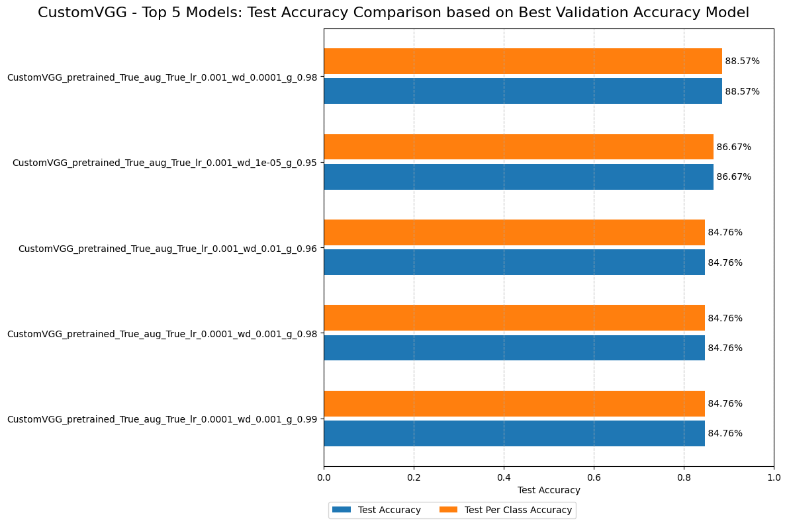

Here are the key insights:

- `Best Performing Model`: The top model is `CustomVGG_pretrained_True_aug_True_lr_0.001_wd_0.0001_g_0.98`, achieving both the highest Test Accuracy and Test Per Class Accuracy at 88.57%.
- `Consistency`: For all models, the Test Accuracy and Test Per Class Accuracy are identical, indicating consistent performance across all classes.
- `Performance Range`: The Test Accuracy for the top 5 models ranges from 84.76% to 88.57%, showing strong overall performance with some variability based on hyperparameters.
- `Hyperparameter Influence`:

  - All top models use pretrained weights (pretrained_True).
  - All top models use data augmentation (aug_True).
  - Learning rates are either 0.001 or 0.0001.
  - Weight decay varies between 1e-05 and 0.01.
  - The gamma value ranges from 0.95 to 0.99.

- `Augmentation Benefit`: The top CustomVGG models perform best with data augmentation, suggesting its effectiveness in improving model performance.
- `Performance Improvement`: There's a 3.81% difference between the best (88.57%) and lowest (84.76%) performers in the top 5, indicating that hyperparameter optimization can lead to significant performance gains.

These results demonstrate that the CustomVGG architecture consistently achieves high accuracy (above 84%) on this task, with the best model reaching 88.57%. The use of pretrained weights and data augmentation appears crucial. The significant performance range among the top 5 models highlights the importance of careful hyperparameter tuning, particularly for learning rate, weight decay, and gamma values. The CustomVGG architecture shows promising results for this classification task, with the potential for high accuracy when optimally configured.

<p align="right">(<a href="#readme-top">back to top</a>)</p>

### Results CNNBasic

The graph displays the performance of the top 5 CNNBasic models based on their Test Accuracy and Test Per Class Accuracy.

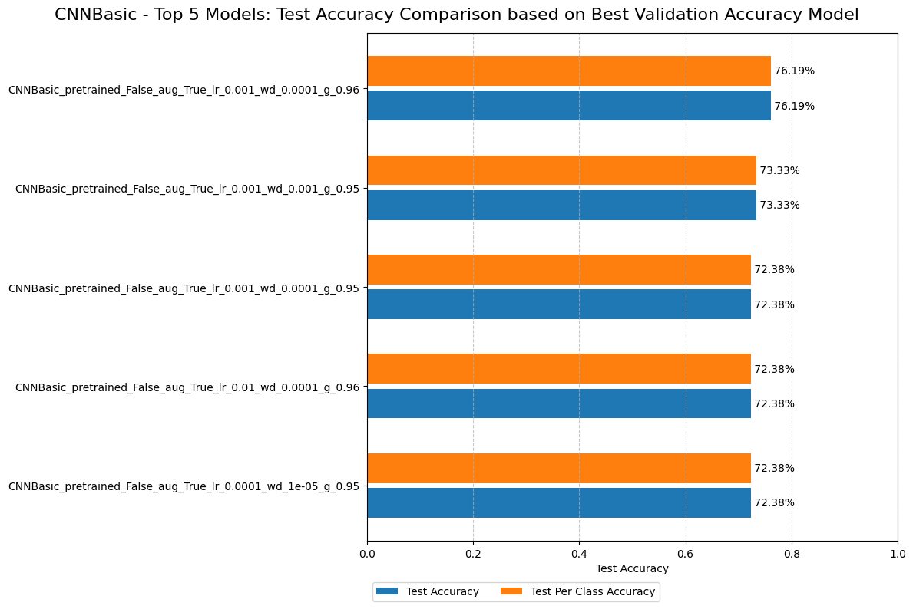

Here are the key observations:

- `Best Performing Model`: The top-performing model is `CNNBasic_pretrained_False_aug_True_lr_0.001_wd_0.0001_g_0.96`, achieving both the highest Test Accuracy and Test Per Class Accuracy at 76.19%.
- `Consistency`: For each model, the Test Accuracy and Test Per Class Accuracy are identical, suggesting consistent performance across all classes.
- `Performance Range`: The Test Accuracy for the top 5 models ranges from 72.38% to 76.19%, indicating some variability in performance across different hyperparameter configurations.
- `Hyperparameter Influence`:

  - All top models do not use pretrained weights, because there are no pretrained weights available (pretrained_False).
  - All top models use data augmentation (aug_True).
  - The learning rate is predominantly 0.001, with one model using 0.01 and another using 0.0001.
  - Weight decay values range from 1e-05 to 0.001.
  - The gamma value ranges from 0.95 to 0.96.

- `Augmentation Benefit`: The top CNNBasic models perform best with data augmentation, suggesting its effectiveness in improving model performance.
- `Performance Improvements`: There's a 3.81 percentage point difference between the best (76.19%) and worst (72.38%) performers in the top 5, indicating that hyperparameter tuning can lead to notable performance gains.

These results suggest that the CNNBasic architecture can achieve performance ranging from low to mid-70% accuracy on this task. The use of data augmentation appears crucial, and training from scratch (not using pretrained weights) seems effective for this model. Fine-tuning other hyperparameters, especially learning rate and weight decay, can lead to substantial performance improvements. The best model's 76.19% accuracy indicates that CNNBasic can be quite effective for this classification task, with room for optimization through careful hyperparameter selection.

<p align="right">(<a href="#readme-top">back to top</a>)</p>

### Results ResNet18

The graph shows the performance of the top 5 ResNet models based on their Test Accuracy and Test Per Class Accuracy.

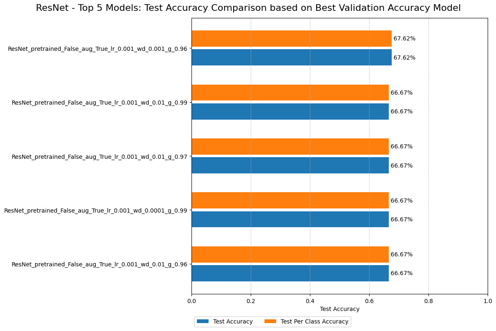

Here are the key observations:

- `Best Performing Model`: The top-performing model is `ResNet_pretrained_False_aug_True_lr_0.001_wd_0.001_g_0.96`, achieving both the highest Test Accuracy and Test Per Class Accuracy at 67.62%.
- `Consistency`: For each model, the Test Accuracy and Test Per Class Accuracy are identical, suggesting consistent performance across all classes.
- `Performance Range`: The Test Accuracy for the top 5 models ranges from 66.67% to 67.62%, showing relatively consistent performance across different hyperparameter configurations.
- `Hyperparameter Influence`:

  - All top models do not use pretrained weights (pretrained_False).
  - All top models use data augmentation (aug_True).
  - The learning rate is consistently 0.001 for all top models.
  - Weight decay values range from 0.0001 to 0.01.
  - The gamma value ranges from 0.96 to 0.99.

- `Augmentation Benefit`: The top ResNet18 models perform best with data augmentation, suggesting its effectiveness in improving model performance.
- `Performance Improvements`: There's only a 0.95 percentage point difference between the best (67.62%) and worst (66.67%) performers in the top 5, indicating that hyperparameter tuning within this range leads to minimal performance gains.

These results suggest that the ResNet architecture achieves performance in the mid to high-60% accuracy range on this task. The use of data augmentation and training from scratch (not using pretrained weights) appears crucial. The consistent learning rate of 0.001 across all top models suggests this is an optimal value for this task. The narrow performance range indicates that the model is relatively robust to changes in weight decay and gamma values within the tested ranges. The best model's 67.62% accuracy, while an improvement over previous results, suggests there may still be room for further optimization or that this task might be challenging for the ResNet architecture as implemented here.

<p align="right">(<a href="#readme-top">back to top</a>)</p>

## Overall Results

This graph compares the test accuracy of the top 5 models across different architectures based on their best validation accuracy.

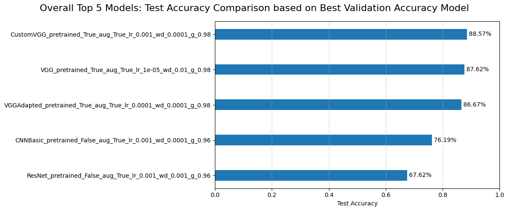

Here's an interpretation of the overall results:

`Best Performing Model`: The CustomVGG model with pretrained weights, data augmentation, learning rate of 0.001, weight decay of 0.0001, and gamma of 0.98 achieves the highest test accuracy at 88.57%.

- `Model Ranking`:
  - CustomVGG: 88.57%
  - VGG: 87.62%
  - VGGAdapted: 86.67%
  - CNNBasic: 76.19%
  - ResNet: 67.62%


- `VGG Family Dominance`: The top 3 performing models are all variants of VGG architecture, significantly outperforming CNNBasic and ResNet.
- `Pretraining Impact`: The top 3 models all use pretrained weights, suggesting that transfer learning is highly effective for this task.
- `Data Augmentation`: All top 5 models use data augmentation, indicating its importance for achieving high performance across different architectures.
- `Hyperparameters`: The top performers use learning rates between 1e-05 and 0.001, and weight decay values between 0.0001 and 0.01.
- `Performance Gap`: There's a substantial performance gap between the VGG-based models (86-88% accuracy) and the other architectures (67-76% accuracy).

The `CustomVGG` model emerged as the clear winner, achieving the highest test accuracy of 88.57%. This strong performance underscores the effectiveness of customizing the VGG architecture for this specific task. The use of pretrained weights and data augmentation appears to be crucial factors in attaining such high performance across all top models.
The significant performance gap between VGG-based models and others, such as CNNBasic and ResNet, highlights that the choice of model architecture has a major impact on results for this particular problem. Moreover, the importance of pretrained weights and data augmentation is evident, as they play a critical role in the models' success.
These results demonstrate the effectiveness of transfer learning and data augmentation techniques, especially when combined with well-suited architectures like VGG variants for this specific classification task.

Confusion Matrix of the Winner:

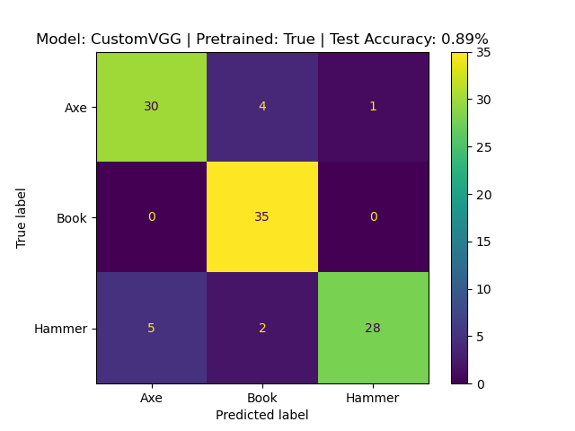

For the top 5 models shown in this graph the confusion matrices, and activation maps for each testing model checkpoint are available in the `saved_models` folder. This allows for a more detailed analysis of each model's performance beyond just the test accuracy. Additionally, one of the activation maps is presented in the next section for demonstration purposes.

<p align="right">(<a href="#readme-top">back to top</a>)</p>

# Activation Maps

The following section presents the activation map of the top-performing model `CustomVGG` based on the best_val_acc model. The image shows one example of all three classes with their heatmap and activation map. Activation maps provide a visual representation of how neural networks "see" and process input images. They highlight the regions of an input image that most strongly activate specific features or neurons within the network. These maps are crucial for understanding which parts of an image are most influential in the network's decision-making process, thereby offering insights into the internal workings and interpretability of neural network models.


The CustomVGG model demonstrates strong performance across different object categories:

- `Axe classification`:
  - The model correctly identifies axes in all presented cases.
  - It mainly considers background elements, suggesting it may use contextual cues, instead of focusing on the axe head.

- `Book classification`:
  - Perfect accuracy in identifying books across various presentations.
  - The model focuses on typical book features like spines, cover text, and overall rectangular shapes.

- `Hammer classification`:
  - Accurate in 2 out of 3 cases, showing good but not perfect performance.
  - The model attends to the hammer head and the junction with the handle.
  - The misclassification of the yellow hammer as a book is interesting, as the model focuses on the text on the handle. This suggests the model might be overly sensitive to text as a book indicator.

- `Adaptability`:
  - The model shows ability to identify objects in different orientations and backgrounds.
  - It can handle partial views of objects, as seen in some book images.

- `Feature focus`:
  - The heatmaps reveal that the model is attending to the most relevant parts of the objects in most cases.

- `Potential for improvement`:
  - The misclassification of the hammer as a book indicates there might be room to refine the model's understanding of text in context.


<p align="right">(<a href="#readme-top">back to top</a>)</p>
