<a name="readme-top"></a>

<!-- PROJECT LOGO -->
<br />
<div align="center">
  <h3 align="center">Image Classification Project</h3>
  <p align="center">
    Balanced dataset preparation and image classification of Hammers, Axes, and Books using VGG, ResNet and Basic CNN models
    <br />
    <a href="https://github.com/eliasmarcon/Image-Classification/issues">Report Bug</a>
    ·
    <a href="https://github.com/eliasmarcon/Image-Classification/issues">Request Feature</a>
  </p>
</div>

<!-- TABLE OF CONTENTS -->
<details>
  <summary>Table of Contents</summary>
  <ol>
    <li><a href="#installation">Requirements Installation</a></li>
      <ol>
          <li><a href="#using-python-with-requirementstxt">Using Python with requirements txt file</a></li>
          <li><a href="#using-conda-on-a-slurm-cluster">Using Conda on a SLURM Cluster</a></li>
      </ol>
    <li><a href="#file-structure">File Structure</a></li>
    <li><a href="#dataset">Dataset</a></li>
      <ol>
        <li><a href="#data-acquisition">Data Acquisition</a></li>
        <li><a href="#dataset-structure">Dataset Structure</a></li>
        <li><a href="#dataset-balancing">Dataset Balancing</a></li>
        <li><a href="#image-formats-and-resizingpadding">Image Formats and Resizing/Padding</a></li>
        <li><a href="#data-augmentation">Data Augmentation</a></li>
          <ul>
            <li><a href="#applying-augmentations">Applying Augmentations</a></li>
            <li><a href="#ensuring-a-clean-testing-dataset">Ensuring a Clean Testing Dataset</a></li>
          </ul>
        <li><a href="#creating-everything-for-the-dataset">Creating everything for the Dataset</a></li>
      </ol>
    <li><a href="#important-files">Important Files</a></li>
      <ol>
        <li><a href="#dataloader">DataLoader</a></li>
        <li><a href="#logger">Logger</a></li>
        <li><a href="#metrics">Metrics</a></li>
        <li><a href="#models">Models</a></li>
        <li><a href="#trainer">Trainer</a></li>
        <li><a href="#tester">Tester</a></li>
        <li><a href="#main">Main</a></li>
      </ol>
    <li><a href="#training--testing">Training & Testing</a></li>
      <ol>
        <li><a href="#tracking--logging">Tracking / Logging</a></li>
        <li><a href="#model-testing-results">Model Testing results</a></li>
          <ol>
            <li><a href="#model-groups-and-instance-counts">Model Groups and Instance Counts</a></li>
            <li><a href="#results-vgg19_no_change">Results VGG19_no_change</a></li>
            <li><a href="#results-vgg19_adapted">Results VGG19_adapted</a></li>
            <li><a href="#results-customvgg">Results CustomVGG</a></li>
            <li><a href="#results-cnnbasic">Results CNNBasic</a></li>
            <li><a href="#results-resnet18">Results ResNet18</a></li>
          </ol>
        <li><a href="#overall-results">Overall Results</a></li>
      </ol>
      <li><a href="#activation-maps">Activation Maps</a></li>
  </ol>
</details>

<br>

# Requirements

Before running the code locally or on a SLURM cluster, please ensure the necessary dependencies are installed. For detailed instructions on setting up the environment look at the sections below. In order to run the code and created models, refer to the [Training & Testing](#training--testing) section.

## Using Python with requirements.txt

1. **Local Environment:**

   - Ensure Python (>=3.10) and pip are installed.

   - Clone the repository:

     ```bash
     git clone <repository_url>
     cd <repository_name>
     ```

   - Install dependencies from `requirements.txt`:
     ```bash
     pip install -r requirements.txt
     ```

## Using Conda on a SLURM Cluster

1. **Setting Up Conda Environment:**

   - Connect to the SLURM cluster.

   - Install all requirements and other dependencies:
     ```bash
     sbatch setup_conda.sh
     ```

2. **Using the Repository:**

   - Note: The FiftyOne library is not available via Conda. Use pip to install it separately if needed:

     ```bash
     pip install fiftyone
     ```

   - Ensure all provided data dependencies are available and accessible within the environment.

3. **Running the Code:**

   - in the `run_cluster.sh` and `run_cluster_sets.sh` file the created conda environment is activated, used and then after the job is done, deactivated.

# File Structure

The file structure of this repository is designed to keep things organized and accessible, allowing for easy navigation and efficient project management.

```

├── dataset/                # All files for every category
│   ├── Axe/                # Raw dataset files for Axe category
│   ├── Axe_augmented/      # Augmented dataset files for Axe category
│   ├── Book/               # Raw dataset files for Book category
│   ├── Hammer/             # Raw dataset files for Hammer category
│   ├── Hammer_augmented/   # Augmented dataset files for Hammer category
├── parameters/             # Hyperparameter sets for model configurations
├── readme_images/          # Images used in the README documentation
├── saved_models/           # Directory containing the best saved model
├── src/                    # Source code directory
│   ├── dataset/            # Scripts for creating and manipulating data
│   ├── models/             # Model architecture files
│   ├── pipeline/           # Scripts for logging, metrics, training, and testing
├── testing_dataset/        # Dataset used for model testing
│   ├── Axe/                # Testing files for Axe category
│   ├── Book/               # Testing files for Book category
│   ├── Hammer/             # Testing files for Hammer category
├── clean_runs.csv          # Log of runs and results
```

<p align="right">(<a href="#readme-top">back to top</a>)</p>

# Dataset

This section provides an overview of the steps taken to prepare a balanced dataset for this computer vision project. The dataset contains images of three classes: Hammer, Axe, and Book from the Open Images V7 dataset.

In order to create the dataset from scratch, the following python command needs to be executed.

```
python .\src\dataset\preparedataset.py
```

<p align="right">(<a href="#readme-top">back to top</a>)</p>

## Data Acquisition

The initial dataset was sourced from the fiftyone library, which provides access to the Open Images V7 dataset. The dataset was specifically filtered to include only images containing the classes: Hammer, Axe, and Book. It was loaded with a maximum of 1,000 samples and shuffled to ensure randomness.

<p align="right">(<a href="#readme-top">back to top</a>)</p>

## Dataset Structure

After filtering and exporting, the dataset was structured into a directory tree suitable for image classification tasks. The structure is as follows:

    dataset/
        ├── Axe/
        ├── Axe_augmented/
        ├── Book/
        ├── Hammer/
        └── Hammer_augmented/

Downloaded Images:

- **Axe**: Contains images of different kinds of axes.
- **Book**: Contains images of books, which initially were overrepresented in the dataset.
- **Hammer**: Contains images of various types of hammers.

<p align="right">(<a href="#readme-top">back to top</a>)</p>

## Dataset Balancing

The initial dataset was imbalanced, with a significantly higher number of images in the "Book" category, as shown in the following graph.

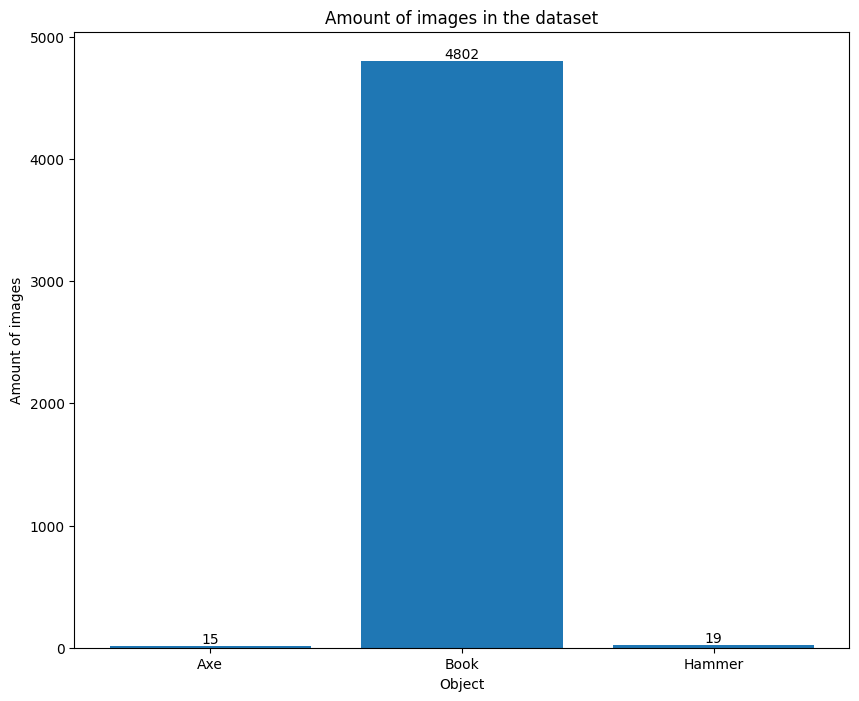

To address this imbalance and ensure fair representation of each class, the number of images in the "Book" category was reduced to 1,500. To increase the number of images in the "Hammer" and "Axe" categories, the preparedataset.py script was executed multiple times. Images across all categories, particularly "Hammer" and "Axe," were reviewed and duplicates were removed. The graph below illustrates the dataset distribution after these adjustments.

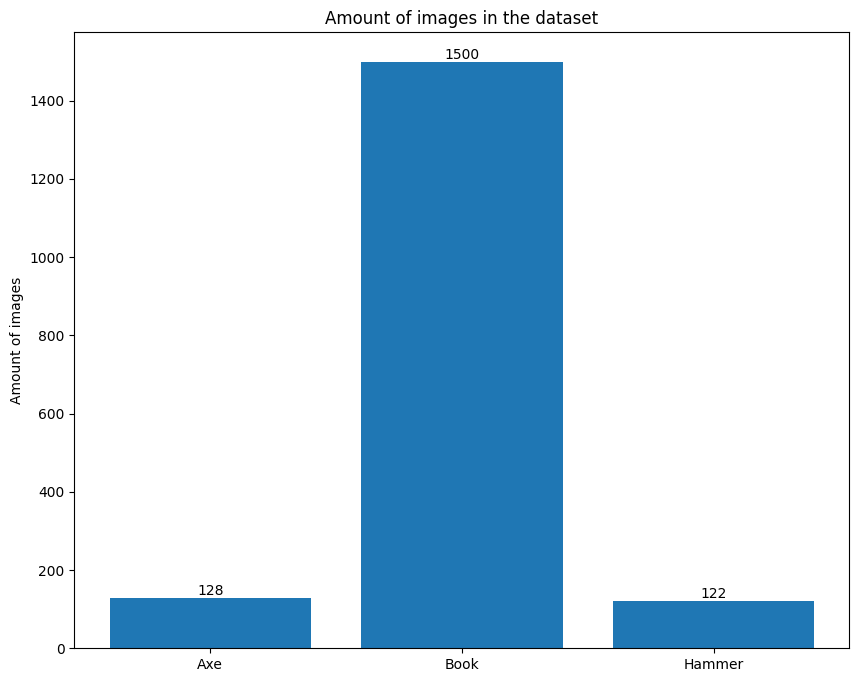

<p align="right">(<a href="#readme-top">back to top</a>)</p>

## Image Formats and Resizing/Padding

The images in the dataset come in various formats. Each category includes images with different resolutions and aspect ratios, which is typical for datasets sourced from diverse origins. To ensure consistency and compatibility with the all models, all images are resized/padded to 224x224 pixels. This resizing/padding standardizes the input size, adhering to the requirements of all models, which expects images of this dimension for optimal performance. Resizing/padding all images to 224x224 pixels ensures uniformity across the dataset, facilitating more effective training and evaluation of the VGG model.

Summary of Image Formats:

- Axe: 119 distinct formats
- Book: 1457 distinct formats
- Hammer: 113 distinct formats

A sample of the resized/padded images can be seen here:

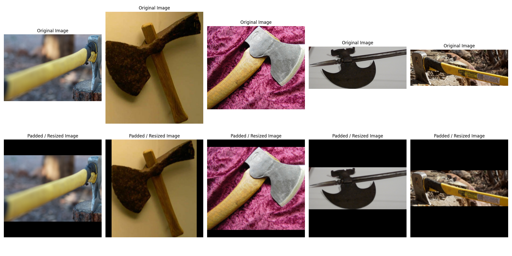

<p align="right">(<a href="#readme-top">back to top</a>)</p>

## Data Augmentation

To achieve a balanced dataset across the three classes (Hammer, Axe, Book), data augmentation techniques are employed. These augmentations increase the diversity of the training data without collecting new images, enhancing the model's ability to generalize. The following augmentations are applied:

- **Random Rotation**: Images are randomly rotated by up to 40 degrees.
- **Random Translation**: Images are randomly shifted horizontally and vertically by up to 20%.
- **Random Horizontal Flip**: Images are flipped horizontally with a probability of 1 (always flipped).
- **Random Vertical Flip**: Images are flipped vertically with a probability of 1 (always flipped).
- **Color Jitter**: The brightness, contrast, saturation, and hue of the images are randomly changed by up to 50%.
- **Gaussian Blur**: A Gaussian blur with a kernel size of 3 is applied to the images.

The `create_augmented_data` function is designed to balance the dataset by oversampling the minority classes (Axe and Hammer) through data augmentation so that they have the same number of images as the majority class (Books). Books, being the majority class, are not augmented. The augmentation process is specifically targeted at the underrepresented classes (Axe and Hammer) to ensure that all classes have an equal number of images, thereby creating a balanced dataset.

<p align="right">(<a href="#readme-top">back to top</a>)</p>

### Applying Augmentations

In addition to defining individual augmentations, a random subset of these augmentations is dynamically applied to each image to further increase variability and robustness.

- **Define the augmentation choices**: A list of potential augmentations is defined, including random rotation, random affine transformation, random horizontal and vertical flips, color jitter, and Gaussian blur.
- **Randomly choose a subset of augmentations**: A random number of augmentations (between 1 and 6) is selected, and then a random subset of these augmentations is chosen.
- **Apply the augmentations**: The chosen augmentations are sequentially applied to the image.

This approach ensures that each image undergoes a unique combination of transformations, further enhancing the diversity of the training dataset. Here is an example of how this process is implemented:

A sample of the augmented images can be seen here:

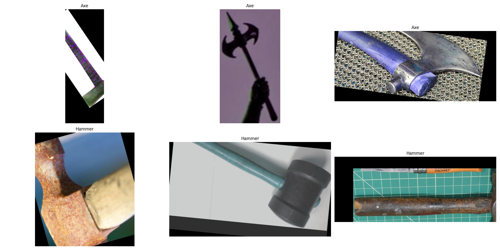

<p align="right">(<a href="#readme-top">back to top</a>)</p>

### Ensuring a Clean Testing Dataset

To ensure that the testing dataset is not influenced by augmented images, the following steps are taken:

Initial Testing Set Creation:

- Before applying augmentations, 30 images from each class are moved to the `testing_dataset` folder. This ensures that the testing phase evaluates the model's performance on original, non-augmented images.

Additional Data Collection:

- To further balance the dataset, 5 images from each class are sourced from the internet and added to the corresponding class folders. This helps in maintaining a robust and varied dataset.

<p align="right">(<a href="#readme-top">back to top</a>)</p>

## Creating everything for the Dataset

In order to create everything outlined in the Dataset chapters, execute the following script:

```
python .\src\dataset\dataset_main.py
```

The provided code performs several key steps to prepare and augment a dataset for image classification:

- **Directory Setup**:
  - Creates a directory for storing images used in the README.
- **Dataset Analysis**:
  - Plots the dataset size before and after reducing it to 1500 images per class.
  - Plots statistics on image formats.
- **Image Preprocessing**:
  - Creates a testing batch.
  - Loads a subset of images and plots both original and padded versions.
- **Data Augmentation**:
  - Loads the entire dataset.
  - Augments images from the minority classes (Axe and Hammer) to match the number of images in the majority class (Books).
  - Plots examples of the augmented images.

<p align="right">(<a href="#readme-top">back to top</a>)</p>

# Important Files

This chapter provides an overview of the components involved in training and evaluating the image classification models. It covers the following key elements:

- **DataLoader**: Custom dataset handler that preprocesses image data, applies transformations, splits data into train and validation sets.
- **Logger**: Tracks and logs the training process, capturing important details such as loss, accuracy, and other metrics over time.
- **Metrics**: Defines the performance metrics used to evaluate the models, ensuring a clear understanding of their accuracy and effectiveness.
- **Models**: Describes the architecture and configurations of the neural network models used for classification.
- **Trainer**: Outlines the training process, including the setup, training loop, and validation steps to optimize model performance.
- **Tester**: Tester class that handles model evaluation, including running tests on a test dataset, creating confusion matrices, and generating heatmaps and CAM (Class Activation Map) visualizations for model interpretability.

<p align="right">(<a href="#readme-top">back to top</a>)</p>

## DataLoader

The `DataLoader` class provides a custom dataset handler that manages image preprocessing, splitting into training and validation sets, and transforming the data for input into a deep learning model. It supports operations such as resizing and padding images, normalizing using ImageNet statistics, and converting data into PyTorch tensors, facilitating efficient data loading for training, validation, and testing.

## Logger

The `WandBLogger` class connects and logs experiment details using Weights & Biases (WandB). It initializes a logging session with project settings and optionally monitors model gradients and parameters. During training or evaluation, it logs custom metrics to WandB, such as loss and accuracy, and finishes by cleanly closing the logging session to ensure data integrity and visibility on the WandB platform.

<p align="right">(<a href="#readme-top">back to top</a>)</p>

## Metrics

The `Accuracy` class calculates and tracks classification accuracy metrics, both overall and per class. Here's an overview:

It initializes with the number of classes and resets internal counters.

The `update` method compares predictions with ground-truth targets, updating counts of total and correct predictions for both overall accuracy and per-class accuracy.

The `__str__` method provides a string representation of the accuracy metrics, including overall accuracy and accuracy for each class ('Axe', 'Book', 'Hammer').

The `accuracy` method computes the overall accuracy based on total and correct predictions.

The `per_class_accuracy` method computes the average accuracy across all classes.

This class facilitates the evaluation of classification model performance by tracking and reporting accuracy metrics, enabling insights into model effectiveness across different classes.

<p align="right">(<a href="#readme-top">back to top</a>)</p>

## Models

The implemented classes in the file `\src\models.py` define different configurations of the VGG19 model for image classification:

- VGGModel: This class initializes VGG19, optionally loading pre-trained weights. It replaces the original classifier with custom fully connected layers, including ReLU activations, Batch Normalization, and Dropout, for classification tasks. It provides methods to freeze feature layers, save, and load model states.

- VGGModelAdapted: This class extends VGG19 by incorporating GELU activations and an additional fully connected layer in the classifier. Similar to VGGModel, it supports freezing feature layers and saving/loading model states, offering a modified architecture for potentially improved performance.

- CustomVGGModel: This class further customizes VGG19 by freezing layers up to conv3 and adding new convolutional and fully connected layers with GELU activations, Batch Normalization, and AdaptiveMaxPool2d. It combines pre-trained features with new learnable layers, providing a flexible architecture for image classification tasks.

- ResNet18: A ResNet-18 model is used for image classification tasks. Defined separately in the project, it leverages residual connections for deeper architectures.

- Basic CNN: A simple CNN architecture tailored for specific image classification requirements. It provides a straightforward baseline for comparison with more complex models like VGG19 and ResNet-18.

<p align="right">(<a href="#readme-top">back to top</a>)</p>

## Trainer

The `Trainer` class manages the training, validation, and testing of the deep learning models. It initializes with necessary components such as the model architecture, optimizer, loss function, data loaders for training and validation, and other parameters like batch size, learning rate scheduler, and logging configuration using WandBLogger. During training, it loops through multiple epochs, updating the model parameters based on backpropagation, and periodically evaluates its performance on the validation set. It implements early stopping based on validation loss and logs metrics using WandBLogger. After training, it provides methods to test the model's performance on a separate test dataset, generating confusion matrices and heatmaps for visualization.

<p align="right">(<a href="#readme-top">back to top</a>)</p>

## Tester

The `Tester` class is a utility for evaluating a trained PyTorch model on a test dataset. It supports loading model checkpoints, performing inference, and calculating evaluation metrics like loss, mean accuracy, and per-class accuracy. Additionally, the class logs these metrics and can generate visualizations such as confusion matrices and class activation maps (CAM) to aid in understanding the model's performance. The CAMs, created using SmoothGradCAM++, highlight important regions in the input images that influenced the model's predictions. This class is essential for thorough model evaluation and interpretability, providing comprehensive insights into model behavior on the test set.

<p align="right">(<a href="#readme-top">back to top</a>)</p>

## Main

This is the main python file, which is designed to train and evaluate deep learning models on a custom image dataset. Here's an overview of its functionality:

The script begins by importing necessary libraries (torch, argparse, os, logging) and setting up logging to format messages clearly. It also sets an environment variable WANDB_SILENT to true to suppress unnecessary output from Weights & Biases (wandb) logging.

Next, it defines a CustomImageDataset class using PyTorch's Dataset module, which manages image tensors and their corresponding labels with optional transformations.

The main(args) function serves as the central logic of the script:

- **Data Loading and Preprocessing**: It loads image paths and labels using data_source.read_data, optionally applying augmentation. Images are resized or padded as needed.

- **Model Initialization**: Depending on args.model_type and args.pretrained, either a VGGModel or CustomVGGModel is initialized and moved to the appropriate device (cuda or cpu).

- **Training Setup**: Loss function (CrossEntropyLoss), optimizer (AdamW), and learning rate scheduler (ExponentialLR) are defined with specified hyperparameters (learning_rate, weight_decay, gamma).

- **Metrics Initialization**: Instances of the Accuracy class are created to track training (train_metric), validation (val_metric), and testing (test_metric) accuracy.

- **Training Execution**: It constructs a run name for wandb logging based on various parameters (wandblogger_run_name) and sets up directories for saving trained models (save_dir and model_save_dir). The Trainer instance (trainer) is initialized with configured components and begins training via trainer.train().

- **Testing**: A separate test dataset is loaded using data_source.read_data from a specified directory (./testing_dataset/). It constructs a test_set using CustomImageDataset and evaluates the trained model using multiple checkpoints (config.test_checkpoints), logging the results.

Finally, the script defines an argument parser (argparse.ArgumentParser) to handle various training parameters (model_type, pretrained, num_epochs, batch_size, etc.). It parses command-line arguments (args) and initiates the training and testing pipeline by calling main(args).

<p align="right">(<a href="#readme-top">back to top</a>)</p>

# Training & Testing

To optimize the training of deep learning models, a comprehensive exploration of various hyperparameter combinations was conducted.

- **Model Type**: The experimentation involves evaluating five distinct model architectures: `VGG`, `VGGAdapted`, `CustomVGG`, `ResNet18` and `CNNBasic`.
- **Pretrained**: Each model of the model type 'VGG' is assessed under two conditions: `with pretrained weights (True)` and `without pretrained weights (False)`. The other two are trained `from scratch`.
- **Learning Rate**: Four different learning rates are used: `0.01`, `0.001`, `0.0001`, and `0.00001`. Due do some erros while testing the models `VGG`, `VGGAdapted`, `CustomVGG` are not trained with the learning rate `0.01`.
- **Weight Decay**: Four values for weight decay are investigated: `0.01`, `0.001`, `0.0001`, and `0.00001`.
- **Gamma**: The evaluation includes five values for gamma: `0.95`, `0.96`, `0.97`, `0.98`, and `0.99`.
- **Data Augmentation**: The experimentation covers two scenarios: `with (True)` and `without (False)` data augmentation.

These hyperparameters result in the training of 1040 models. The models can be trained either locally or on a Slurm cluster using specific scripts: `run_cluster.sh` and `run_cluster_sets.sh`. Here’s how these scripts function:

- locally:

  ```
  python \src\main.py -m VGG -p -e 30 -b 32 -l 0.0005 -w 0.00005 -g 0.99 -f 1 -es 20 -a -c
  ```

  This command will run the script main.py located in the \src directory with the following configurations:

  - **-m** VGG: Specifies the model type as VGG.
  - **-p**: Uses a pretrained model (since it's specified without a value, it defaults to True).
  - **-e** 30: Sets the number of epochs to 30.
  - **-b** 32: Defines the batch size as 32.
  - **-l** 0.0005: Sets the learning rate to 0.0005.
  - **-w** 0.00005: Specifies the weight decay as 0.00005.
  - **-g** 0.99: Sets the gamma value for the learning rate scheduler to 0.99.
  - **-f** 1: Specifies the validation frequency as 1.
  - **-es** 20: Sets the early stopping patience to 20.
  - **-a**: Enables data augmentation for training.
  - **-c**: Enables confusion matrix and heatmaps for testing.

Adjust these arguments based on individual specific requirements and the structure of the main.py script.

- Slurm cluster:

  ```
  sbatch run_cluster.sh CustomVGG True 2 32 0.1 0.001 0.99 false True

  sbatch run_cluster_sets.sh 7
  ```

`run_cluster.sh`: This script allows testing of individual custom hyperparameters. It's suitable for running a single experiment with user-defined settings.

`run_cluster_sets.sh`: This script takes an input file number as an argument (`hyperparameter_file_number`) and runs a predefined set of hyperparameters. The hyperparameter set is fetched from a specific file located at `parameters/hyperparameters_filenumber.txt`. This approach enables systematic testing of multiple hyperparameter combinations in batch mode on the Slurm cluster.

`setup_conda.sh`: This script automatically sets up a new conda environment and installs all necessary requirements.

<p align="right">(<a href="#readme-top">back to top</a>)</p>

## Tracking / Logging

Metrics and model training details are logged using the Weights and Biases (wandb) platform. Weights and Biases provides a suite of tools for experiment tracking, including real-time visualization of metrics, model performance, and system metrics. For more details on setting up and using wandb, refer to the [Weights and Biases documentation](https://docs.wandb.ai/?_gl=1*sm4dkz*_ga*MTAxNzQ1OTkzMS4xNzEzNzA0NzUx*_ga_JH1SJHJQXJ*MTcyMDY4ODM2My43OS4xLjE3MjA2ODg4OTUuNDcuMC4w).

<p align="right">(<a href="#readme-top">back to top</a>)</p>

## Model Testing results

This section details the various model groups and their corresponding instance counts used within the project repository. The categorization aims to provide insights into the scale and distribution of experiments and model training runs.

The categorization of model groups and instance counts serves the following purposes:

- `Tracking and Managing Experiments`: Documenting the number of instances per model group facilitates efficient tracking and management of experiments.
- `Comparative Analysis`: Instance counts enable comparative analysis, allowing evaluation of the performance and efficiency of different model architectures.
- `Resource Allocation`: Understanding the distribution of model instances supports optimal allocation of computational resources, ensuring efficient use across experiments.

The following table shows each model and their instance count. The CNNBasic and ResNet18 instance count is smaller due to the fact that these models are just trained from scratch without using pretrained weights. All data and results for the runs in this section are in the `clean_runs.csv` file and can be looked at the [Wandb Project](https://wandb.ai/hansij922/Image-Classification?nw=nwuserhansij922).

| Group           | Instance Count |
| --------------- | -------------- |
| VGG19_no_change | 240            |
| VGG19_adapted   | 240            |
| CustomVGG       | 240            |
| CNNBasic        | 160            |
| ResNet18        | 160            |

<p align="right">(<a href="#readme-top">back to top</a>)</p>

### Results VGG19_no_change

The graph illustrates the performance of the top 5 VGG models, comparing their Test Accuracy and Test Per Class Accuracy.

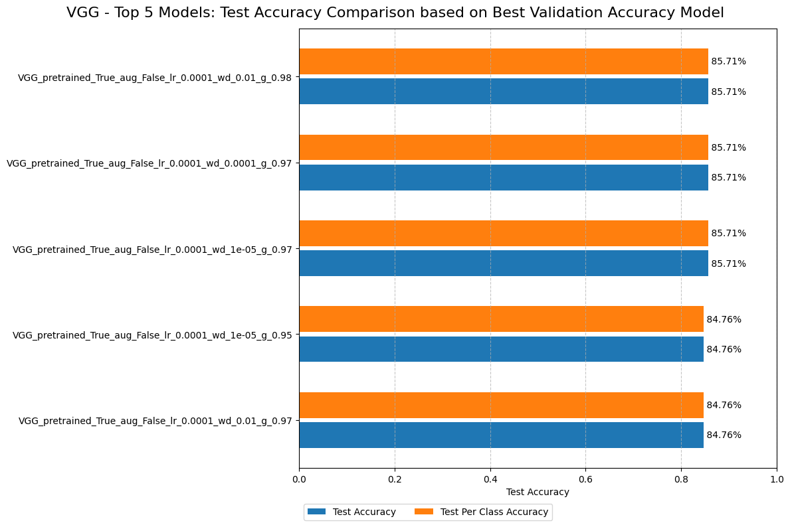

Here are the key observations:

- `Best Performing Model`: The top models are "VGG_pretrained_True_aug_False_lr_0.0001_wd_0.01_g_0.98", "VGG_pretrained_True_aug_False_lr_0.0001_wd_0.0001_g_0.97", "VGG_pretrained_True_aug_False_lr_0.0001_wd_1e-05_g_0.97", achieving both the highest Test Accuracy and Test Per Class Accuracy at 85.71%.
- `Consistency`: For all models, the Test Accuracy and Test Per Class Accuracy are identical, indicating consistent performance across all classes.
- `Performance Range`: The Test Accuracy for the top 5 models ranges from 84.76% to 85.71%, demonstrating high and consistent performance across different hyperparameter configurations.
- `Hyperparameter Influence`:

  - All top models use pretrained weights (pretrained_True).
  - Interestingly, all top models use no data augmentation (aug_False).
  - Learning rate is 0.0001 for all top models.
  - Weight decay varies widely from 1e-05 to 0.01.
  - The gamma value ranges from 0.95 to 0.98.

- `No Augmentation Benefit`: Unlike many other architectures, the top VGG models perform best without data augmentation, suggesting that the pretrained weights are highly effective for this task.
- `Marginal Improvements`: The performance difference between the best and worst model in the top 5 is relatively small (0.95%), indicating that the VGG architecture is robust across various hyperparameter settings.

These results demonstrate that the VGG architecture, when using pretrained weights, achieves excellent performance (above 84%) on this task without requiring data augmentation. The high accuracy across all top models suggests that VGG is particularly well-suited for this classification task. The slight variations in performance due to different weight decay and gamma values highlight the importance of fine-tuning these hyperparameters, even with a robust architecture like VGG.

<p align="right">(<a href="#readme-top">back to top</a>)</p>

### Results VGG19_adapted

The graph presents the performance of the top 5 VGGAdapted models, comparing their Test Accuracy and Test Per Class Accuracy.

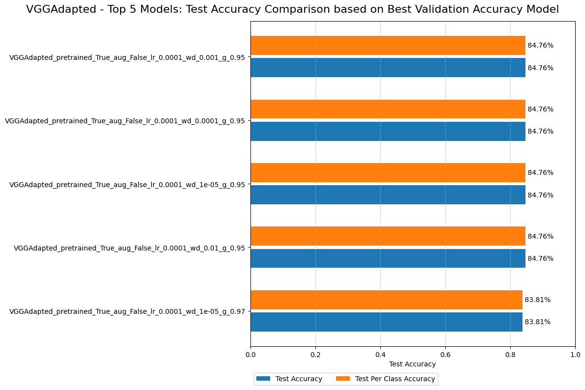

Here are the key insights:

- `Best Performing Models`: The top four models all achieve the highest Test Accuracy and Test Per Class Accuracy at 84.76%. These are:

  - VGGAdapted_pretrained_True_aug_False_lr_0.0001_wd_0.001_g_0.95
  - VGGAdapted_pretrained_True_aug_False_lr_0.0001_wd_0.0001_g_0.95
  - VGGAdapted_pretrained_True_aug_False_lr_0.0001_wd_1e-05_g_0.95
  - VGGAdapted_pretrained_True_aug_False_lr_0.0001_wd_0.01_g_0.95

- `Consistency`: For all models, the Test Accuracy and Test Per Class Accuracy are identical, indicating consistent performance across all classes.
- `Performance Range`: The Test Accuracy for the top 5 models ranges from 83.81% to 84.76%, demonstrating excellent and consistent performance across different hyperparameter configurations.
- `Hyperparameter Influence`:

  - All top models use pretrained weights (pretrained_True).
  - Notably, all top models use no data augmentation (aug_False).
  - The learning rate is consistently 0.0001.
  - Weight decay varies between 1e-05 and 0.01.
  - The gamma value is 0.95 for the top 4 models and 0.97 for the last model.

- `No Augmentation Benefit`: Similar to the standard VGG, the VGGAdapted models perform best without data augmentation, suggesting that the pretrained weights and model adaptations are highly effective for this task.
- `Marginal Improvements`: The performance difference between the best and worst model in the top 5 is relatively small (0.95%), indicating that the VGGAdapted architecture is robust across various hyperparameter settings.

These results demonstrate that the VGGAdapted architecture achieves outstanding performance (above 83%) on this task. The consistent high accuracy across all top models, especially the four models achieving 84.76%, suggests that VGGAdapted is particularly well-suited for this classification task. The results also highlight the importance of using pretrained weights and careful tuning of learning rate and weight decay, even with minimal differences in the top-performing models.

<p align="right">(<a href="#readme-top">back to top</a>)</p>

### Results CustomVGG

The graph showcases the performance of the top 5 CustomVGG models, comparing their Test Accuracy and Test Per Class Accuracy.

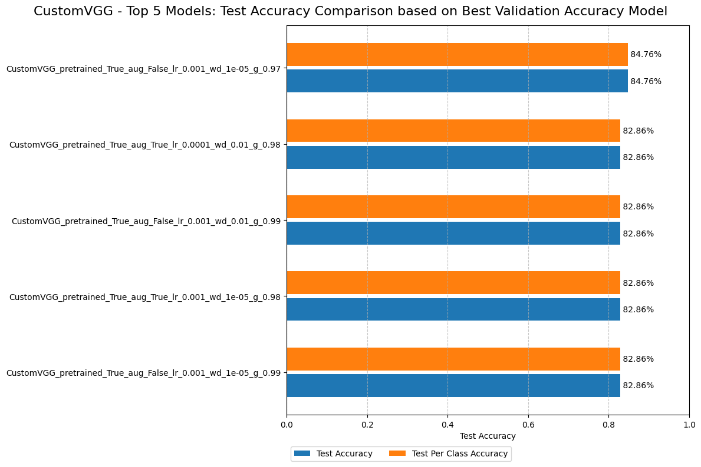

Here are the key insights:

- `Best Performing Model`: The top model is "CustomVGG_pretrained_True_aug_False_lr_0.001_wd_1e-05_g_0.97", achieving both the highest Test Accuracy and Test Per Class Accuracy at 84.76%.
- `Consistency`: For all models, the Test Accuracy and Test Per Class Accuracy are identical, indicating consistent performance across all classes.
- `Performance Range`: The Test Accuracy for the top 5 models ranges from 82.86% to 84.76%, showing strong overall performance with minimal variability based on hyperparameters.
- `Hyperparameter Influence`:

  - All top models use pretrained weights (pretrained_True).
  - Three out of five top models do not use data augmentation (aug_False).
  - Learning rates are either 0.001 or 0.0001.
  - Weight decay varies between 1e-05 and 0.01.
  - The gamma value ranges from 0.97 to 0.99.

- `Augmentation Impact`: The top-performing model doesn't use augmentation, and only two of the five use it, suggesting that for this CustomVGG architecture, augmentation may not always be beneficial.
- `Performance Improvement`: TThere's a 1.9% difference between the best (84.76%) and other performers (82.86%) in the top 5, indicating that some hyperparameter combinations can lead to modest performance gains.

These results demonstrate that the CustomVGG architecture consistently achieves high accuracy (above 82%) on this task. The use of pretrained weights appears crucial, and fine-tuning other hyperparameters can lead to small but potentially important performance gains. The best model's 84.76% accuracy suggests that CustomVGG is effective for this particular classification task, with relatively consistent performance across different configurations.

<p align="right">(<a href="#readme-top">back to top</a>)</p>

### Results CNNBasic

The graph displays the performance of the top 5 CNNBasic models based on their Test Accuracy and Test Per Class Accuracy.

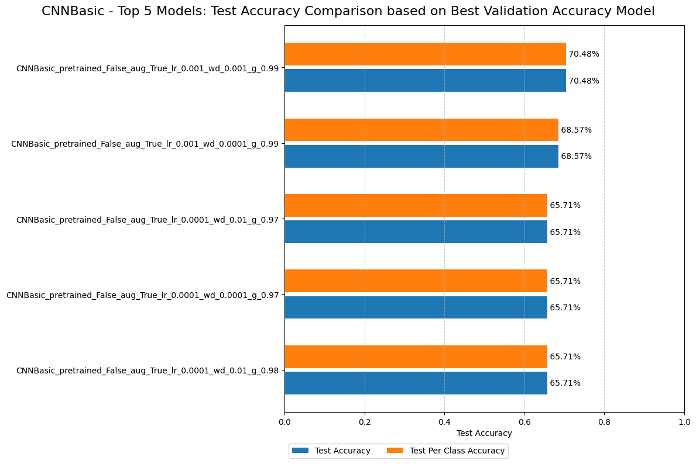

Here are the key observations:

- `Best Performing Model`: The top-performing model is "CNNBasic_pretrained_False_aug_True_lr_0.001_wd_0.001_g_0.99", achieving both the highest Test Accuracy and Test Per Class Accuracy at 70.48%.
- `Consistency`: For each model, the Test Accuracy and Test Per Class Accuracy are identical, suggesting consistent performance across all classes.
- `Performance Range`: The Test Accuracy for the top 5 models ranges from 65.71% to 70.48%, indicating some variability in performance across different hyperparameter configurations.
- `Hyperparameter Influence`:

  - All top models use data augmentation (aug_True).
  - The learning rate varies between 0.001 and 0.0001.
  - Weight decay values range from 0.0001 to 0.01.
  - The gamma value ranges from 0.97 to 0.99.

- `Performance Improvements`: There's a noticeable 4.77 percentage point difference between the best (70.48%) and worst (65.71%) performers in the top 5, indicating that hyperparameter tuning can lead to significant performance gains.

These results suggest that the CNNBasic architecture can achieve performance ranging from mid-60% to low-70% accuracy on this task. The use of data augmentation appears crucial, and fine-tuning other hyperparameters, especially learning rate and weight decay, can lead to substantial performance improvements. The best model's 70.48% accuracy indicates that CNNBasic can be effective for this classification task, with room for optimization through hyperparameter tuning.

<p align="right">(<a href="#readme-top">back to top</a>)</p>

### Results ResNet18

The graph shows the performance of the top 5 ResNet18 models based on their Test Accuracy and Test Per Class Accuracy.

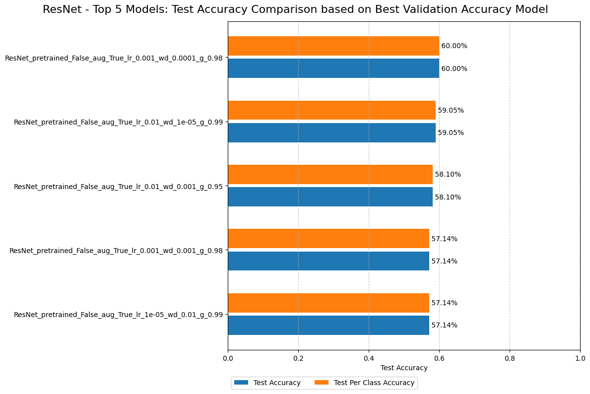

Here are the key observations:

- `Best Performing Models`: The top-performing model is "ResNet_pretrained_False_aug_True_lr_0.001_wd_0.0001_g_0.98", achieving both the highest Test Accuracy and Test Per Class Accuracy at 60.00%.
- `Consistency`: For each model, the Test Accuracy and Test Per Class Accuracy are identical, suggesting consistent performance across all classes.
- `Performance Range`: The Test Accuracy for the top 5 models ranges from 57.14% to 60.00%, showing some variability in performance across different hyperparameter configurations.
- `Hyperparameter Influence`:

  - All top models use data augmentation (aug_True).
  - Learning rates vary between 1e-05 and 0.01.
  - Weight decay values range from 1e-05 to 0.001.
  - The gamma value ranges from 0.95 to 0.99.

- `Performance Improvements`: There's a 2.86 percentage point difference between the best (60.00%) and worst (57.14%) performers in the top 5, indicating that hyperparameter tuning can lead to modest but noticeable performance gains.

These results suggest that the ResNet architecture achieves performance in the high-50% to low-60% accuracy range on this task. The use of data augmentation appears crucial, and fine-tuning other hyperparameters can lead to small but potentially important performance improvements. The best model's 60.00% accuracy indicates that this ResNet implementation has room for further optimization for this classification task.

<p align="right">(<a href="#readme-top">back to top</a>)</p>

## Overall Results

This graph compares the test accuracy of the top 5 models across different architectures based on their best validation accuracy.

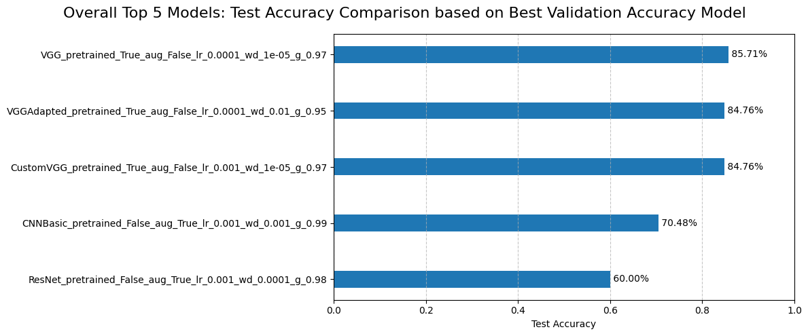

Here's an interpretation of the overall results:

- `Best Performing Model`: The VGG model with pretrained weights, no data augmentation, learning rate of 0.0001, weight decay of 1e-05, and gamma of 0.97 achieves the highest test accuracy at 85.71%.
- `Model Ranking`:

  - VGG: 85.71%
  - VGGAdapted: 84.76%
  - CustomVGG: 84.76%
  - CNNBasic: 70.48%
  - ResNet: 60.00%

- `VGG Family Dominance`: The top 3 performing models are all variants of VGG architecture, significantly outperforming CNNBasic and ResNet.
- `Pretraining Impact`: The top 3 models all use pretrained weights, suggesting that transfer learning is highly effective for this task, instead of training the models from scratch.
- `Data Augmentation`: Interestingly, none of the top 3 models use data augmentation, indicating that it wasn't necessary for top performance in this case.
- `Hyperparameters`: The top performers generally use a low learning rate (0.0001 or 0.001) and vary in weight decay (1e-05 to 0.01).
- `Performance Gap`: There's a substantial performance gap between the VGG-based models (84-85% accuracy) and the other architectures (60-70% accuracy).

The VGG model emerged as the clear winner, achieving the highest test accuracy of 85.71%. This strong performance underscores the suitability of the VGG architecture for this specific task. The use of pretrained weights appears to be a crucial factor in attaining such high performance. The significant performance gap between VGG-based models and others, such as CNNBasic and ResNet, highlights that the choice of model architecture has a major impact on results for this particular problem. Moreover, the importance of pretrained weights cannot be overstated, as they play a critical role in the model's success.

For the top 5 models shown in this graph, all model files, confusion matrices, and activation maps for each testing model checkpoint are available in the `saved_models folder`. This allows for a more detailed analysis of each model's performance beyond just the test accuracy. Additionally, one of the activation maps is presented in the next section for demonstration purposes.

<p align="right">(<a href="#readme-top">back to top</a>)</p>

# Activation Maps

The following section presents the activation map of the top-performing model `VGG` based on the best_val_acc model. The image shows one example of all three classes with their heatmap and activation map. Activation maps provide a visual representation of how neural networks "see" and process input images. They highlight the regions of an input image that most strongly activate specific features or neurons within the network. These maps are crucial for understanding which parts of an image are most influential in the network's decision-making process, thereby offering insights into the internal workings and interpretability of neural network models.

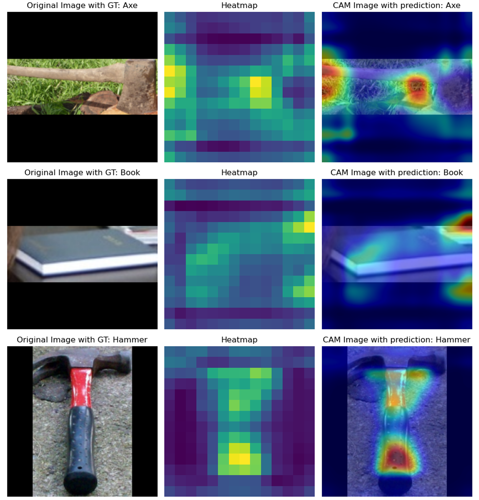


In the presented activation map images, one of the predictions is incorrect, indicating the otherwise good performance of the VGG model, which achieved an accuracy of 85.71%. This misclassification is somewhat predictable, as the objects in question—an axe and a hammer—look quite alike, leading to confusion. The activation maps for this case do not look as clear as the others, highlighting the model's occasional difficulty in distinguishing between visually similar objects. Despite this, the overall test accuracy of 85.71% demonstrates the strong performance of the VGG architecture for this task. This discrepancy suggests that while the model performs well on average, there are specific instances where it fails to correctly identify important features in the input images.

<p align="right">(<a href="#readme-top">back to top</a>)</p>
